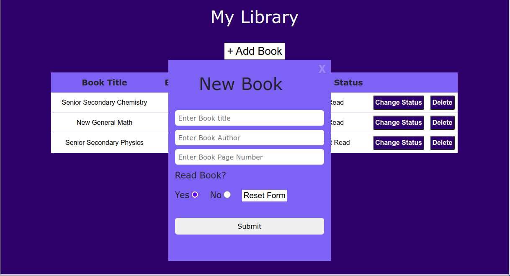
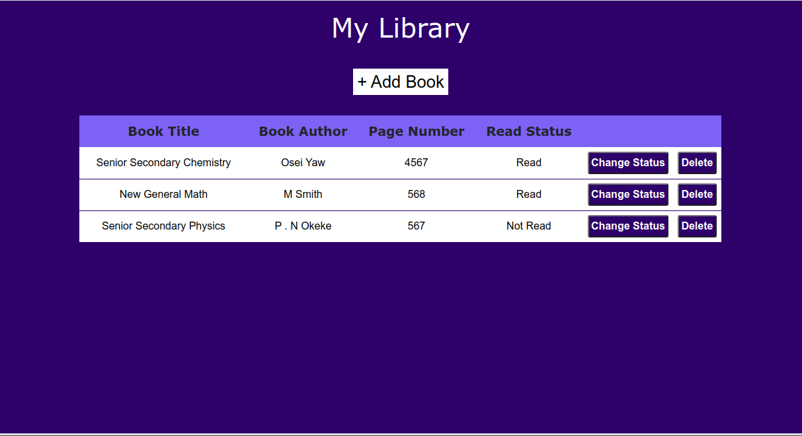
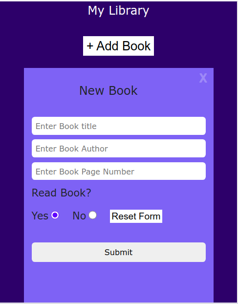
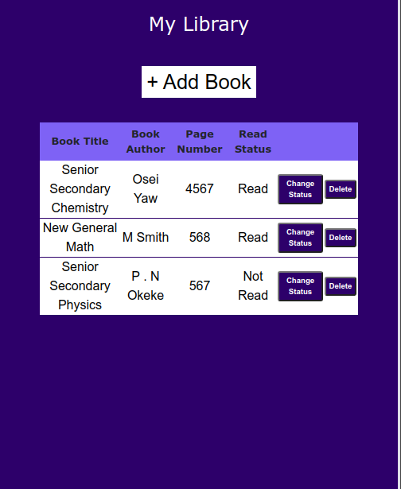

## Library App

This is a library application designed to store book objects in an array. Records are stored using the JavaScript localStorage. Users enter records in this application by clicking on the Add Book button shown at the top of the page. This button opens a form where users will be required to enter the book title, author, number of pages, and select read status. By clicking submit, the record is displayed below the button. Users should not store a book with the same title twice. Duplicate records are not permitted.

## Preview

## Home Page with Log in Form, Desktop view


## Book List, Desktop view


## Home Page with Log in Form, Mobile view


## Book List, Mobile view



## Features 
- Users can add a new book with the required parameters.
- Users can change the read status of books in the record. 
- Users can delete unwanted records.

## Project SetUp

Get a local copy of the file. Clone with HTTPS using the command below.

```
git clone https://github.com/Zubenna/library.git
```
## Access project folders 
```
cd library
```
- Click on index.html to display the application on the browser.
- Text all application features.

## Live Version
- [Launch App](https://zubenna.github.io/library/)

## Built With
- JavaScript
- HTML
- CSS
- Bootstrap 4

## Authors

👤 **Nnamdi Emelu**
- Github: [@zubenna](https://github.com/zubenna)
- Twitter: [@zubenna](https://twitter.com/zubenna)
- Linkedin: [nnamdi-emelu](https://www.linkedin.com/in/nnamdi-emelu/)

##  Contributing

Contributions, issues, and feature requests are welcome!

Feel free to check the [issues page](https://github.com/Zubenna/library/issues)

## Show your support

Give a star if you like this project!

## Acknowledgments
- Project originally taken from The Odin Project
- Project inspired by Microverse Program
